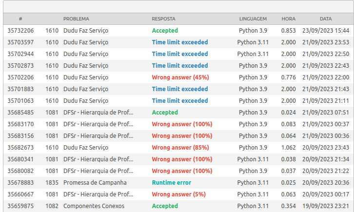

# Grafos1_BeeExercises

**Número da Lista**: 1 
**Conteúdo da Disciplina**: Grafos 1 

## Alunos
|Matrícula | Aluno |
| -- | -- |
| 202016669 |  Juan Mangueira Alves |
| 211039297 |  Bruno Martins Valério Bomfim  |

## Sobre 
Este trabalho compreende a resolução de alguns exercícios do juiz online Beecrowd. Foram escolhidos exercícios de níveis variados, sendo que a tabela abaixo resume os atores, enunciados e resoluções.

| Autor | Enunciado | Resolução |
| -- | -- | -- |
| Bruno Martins | [Bee #1081](https://www.beecrowd.com.br/judge/pt/problems/view/1081) | [Checar Resolução](bee1081.py)
| Bruno Martins | [Bee #1082](https://www.beecrowd.com.br/judge/pt/problems/view/1082) | [Checar Resolução](bee1082.py)
| Bruno Martins | [Bee #1610](https://www.beecrowd.com.br/judge/pt/problems/view/1610) | [Checar Resolução](bee1610.py)

*Obs:* A pasta tryings contém exercícios de nível avançado (7, 8 e 9) que estão parcialmente concluídos. Através do histórico de commits é possível ver a evolução dos mesmos.

[Vídeo 1 - Bruno Martins](video.mp4)

## Screenshots

## Instalação 
**Linguagens**:

    

**Framework**: Nenhum. 